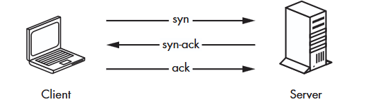
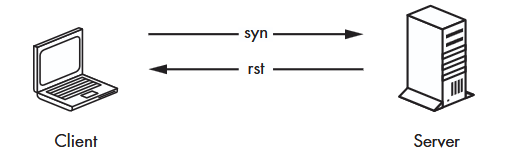
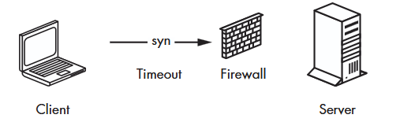
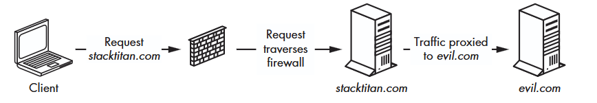

## Understanding the TCP Handshake
The below screenshots shows how TCP uses a handshake process 
when querying a port to determine whether the port is open, closed, or filtered.

#### Open Port
If the port is open, a three-way handshake takes place. First, the client sends a syn packet,
or acknowledgment of the syn packet it received, prompting the client to finish with an ack, or acknowledgment of the servers response.

#### Closed Port
If the port is closed, the server responds with a rst packet instead of a syn-ack

#### Filterd Port
If the traffic is being filtered by a firewall, the client will typically receive no
response from the server.

## Bypassing Firewalls with Port Forwarding
People can configure firewalls to prevent a client from connecting to certain
servers and ports, while allowing access to others.
In some cases, you can circumvent these restrictions by using an intermediary 
system to proxy the connection around or through a firewall, a technique known as port forwarding.

1. Imagine a nefarious site called evil.com.
2. If an employee attempts to browse evil.com directly, a firewall blocks the request
3. However, should an employee own an external system thats allowed through the firewall (for example, stacktitan.com)
4. That employee can leverage the allowed domain to bounce connectionsto evil.com

# Scanners
In the `scanners` folder are different kinds of imprementations, each one 
improving on the previous. This progression shows why the naive approach 
isn't enough, and how we get to a correct concurrent scanner.

#### single-port-scanner.go
Dials a single TCP port (`scanme.nmap.org:80`) using `net.Dial`. If `err` 
is `nil`, the connection succeeded. The most basic building block — no 
loop, no concurrency.

#### nonconcurrent-scanning.go
Loops through ports 1–1024 sequentially, dialing each one and closing the 
connection if successful. Works, but slow — each port is scanned one at a 
time, so it takes as long as the sum of all connection attempts.

#### concurent-scanning.go
Wraps each `Dial` call in a goroutine to scan all ports at once. Much 
faster, but broken: `main()` doesn't wait for the goroutines to finish, so 
the program exits almost instantly, before most connections even complete. 
Results are unreliable.

#### synchronized-scanning.go
Fixes the previous version using `sync.WaitGroup`. `wg.Add(1)` before each 
goroutine, `wg.Done()` when it finishes, and `wg.Wait()` in `main()` blocks 
until all scans are done. Correct and concurrent — but scanning too many 
ports at once can still overwhelm the network/system and skew results.

#### workerPool-scanner.go
Introduces a worker pool using a buffered channel and `sync.WaitGroup`. 
100 worker goroutines consume ports via `range`. No actual scanning — 
demonstrates the pool pattern before adding network logic.

#### tcp-scanner-final.go
Complete port scanner using two channels: `ports` (buffered) for work 
distribution and `results` for collecting outcomes. Workers send `0` for 
closed, port number for open. `WaitGroup` is replaced by receiving exactly 
1024 results — same synchronization, no counter. Output is sorted.